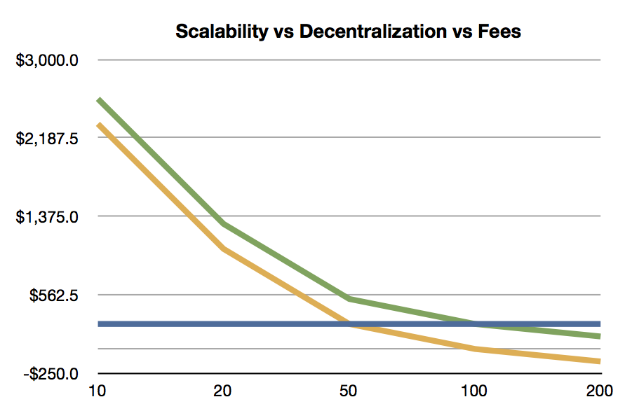

Delegated Proof of Stake
========================

Delegated Proof of Stake (DPOS) is a new method of securing a
crypto-currency's network. DPOS attempts to solve the problems of both
Bitcoin's traditional Proof of Work system, and the Proof of Stake
system of Peercoin and NXT. DPOS implements a layer of technological
democracy to offset the negative effects of centralization.

Background
----------

Delegated proof of stake mitigates the potential negative impacts of
centralization through the use of witnesses (formaly called
*delegates*). A total of N witnesses sign the blocks and are voted on by
those using the network with every transaction that gets made. By using
a decentralized voting process, DPOS is by design more democratic than
comparable systems. Rather than eliminating the need for trust all
together, DPOS has safeguards in place the ensure that those trusted
with signing blocks on behalf of the network are doing so correctly and
without bias. Additionally, each block signed must have a verification
that the block before it was signed by a trusted node. DPOS eliminates
the need to wait until a certain number of untrusted nodes have verified
a transaction before it can be confirmed.

This reduced need for confirmation produces an increase in speed of
transaction times. By intentionally placing trust with the most
trustworthy of potential block signers, as decided by the network, no
artificial encumbrance need be imposed to slow down the block signing
process. DPOS allows for many more transactions to be included in a
block than either proof of work or proof of stake systems. DPOS
technology allows cryptocurrency technology to transact at a level where
it can compete with the centralized clearinghouses like Visa and
Mastercard. Such clearinghouses administer the most popular forms of
electronic payment systems in the world.

In a delegated proof of stake system centralization still occurs, but it
is controlled. Unlike other methods of securing cryptocurrency networks,
every client in a DPOS system has the ability to decide who is trusted
rather than trust concentrating in the hands of those with the most
resources. DPOS allows the network to reap some of the major advantages
of centralization, while still maintaining some calculated measure of
decentralization. This system is enforced by a fair election process
where anyone could potentially become a delegated representative of the
majority of users.

Rationale Behind DPOS
---------------------

-   Give shareholders a way to delegate their vote to a key (one that
    doesn't control coins 'so they can mine')
-   Maximize the dividends shareholders earn
-   Minimize the amount paid to secure the network
-   Maximize the performance of the network
-   Minimize the cost of running the network (bandwidth, CPU, etc)

### Shareholders are in Control

The fundamental feature of DPOS is that shareholders remain in control.
If they remain in control then it is decentralized. As flawed as voting
can be, when it comes to shared ownership of a company it is the only
viable way. Fortunately if you do not like who is running the company
you can sell and this market feedback causes shareholders to vote more
rationally than citizens.

Every shareholder gets to vote for someone to sign blocks in their stead
(a representative if you will). Anyone who can gain 1% or more of the
votes can join the board. The representatives become a "board of
directors" which take turns in a round-robin manner, signing blocks. If
one of the directors misses their turn, clients will automatically
switch their vote away from them. Eventually these directors will be
voted off the board and someone else will join. Board members are paid a
small token to make it worth their time ensuring uptime and an incentive
to campaign. They also post a small bond equal to 100x the average pay
they receive for producing a single block. To make a profit a director
must have greater than 99% uptime.

### Pooled Mining as Delegated Proof of Work

So how is this different than Bitcoin? With Bitcoin, users must pick a
mining pool and each pool generally has 10% or more of the hash power.
The operator of these pools is like a representative of the clients
pointed at the pool. Bitcoin expects the users to switch pools to keep
power from becoming too centralized, but collectively five major pools
control the network and manual user intervention is expected if one of
the pools is compromised. If a pool goes down then the block production
rate slows proportionally until it comes back up. Which pool one mines
with becomes a matter of politics.

### Reasons to not randomly select representatives from all users

-   High probability they are not online.
-   Attackers would gain control proportional to their stake, without
    any peer review.
-   Without any mining at all, the generation of a random number in a
    decentralized manner is impossible and thus an attacker could
    control the random number generation.

Scalability
-----------

Assuming a fixed validation cost per transaction and a fixed fee per
transaction, there is a limit to the amount of decentralization that can
take place. Assuming the validation cost exactly equals the fee, a
network is completely centralized and can only afford one validator.
Assuming the fee is 100x the cost of validation, the network can support
100 validators.

Systems like Nxt and Peercoin will have excessive fees if they intend to
allow everyone to be a validator and earn fees at scale. What this means
for Nxt and Peercoin is that anyone with less than 1% stake cannot
validate profitably unless their fees are higher than our DPOS chain. If
these chains assume 100 delegates is too centralized and start promoting
they have 1000 validators, then their fees must be 10x those of DPOS. If
such a chain grew to be the size of Bitcoin (\$10 B) then only those
with \$1M worth of coin could validate profitably and most would
consider that an elite club. If they reduce the minimum stake to be a
validator to \$1000, then their fees would be 10,000 times higher than
DPOS.

Developers of DPOS assume that everyone with less than the amount
required to validate won't participate. Also assumed is a "reasonable"
distribution of wealth. It's clear that unless alternate chains have
unusually high fees, there will only be a handful of people with enough
stake to validate profitably.

In conclusion, the only way for POS to work efficiently is to delegate.
In the case of Nxt, they can pool their stake by some means and
ultimately this will end up like DPOS prior to approval voting with a
variable number of delegates. Delegates wouldn't actually receive any
income as with mining pools because the validation expenses will consume
the vast majority of the transaction fees.

The end result is that decentralization has a cost proportional to the
number of validators and that costs do not disappear. At scale, these
costs will centralize any system that does not support delegation. This
kind of centralization should be designed as part of the system from the
beginning so that it can be properly managed and controlled by the
users, instead of evolving in some ad hoc manner as an unintended
consequence.

Role of Delegates
-----------------

-   A witness is an authority that is allowed to produce and broadcast
    blocks.
-   Producing a block consists of collecting transactions of the P2P
    network and signing it with the witness' signing private key.
-   A witness' spot in the round is assigned randomly at the end of the
    previous block

How to become a witness in Graphene
------------------------

tutorials/witness-create

Voting Algorithm
----------------

### How do I get "votes?"

-   Persuade others to give upvotes to your witness
-   When another user gives an upvote to your (and possibly other)
    delegates
-   A user can give an upvote for more than one witness. As a result all
    upvoted witnesse get a vote
-   Convince proxies (that vote on behalf of their followers) to vote
    for you

### Why use only upvotes?

-   Giving only upvotes, and allowing multiple votes per share, is
    called **Approval Voting**, and comes with several advantages over
    the old *delegation* voting.
-   No downvotes are needed, which not only simplifies usability but
    also reduces code and complexity.

### How are 'votes' counted?

Once every *maintenance interval*, all votes are recounted and the
corresponding result takes effect.

### Is there an anti-vote?

Not any more. After discovering [emski's
attack](https://bitsharestalk.org/index.php?topic=5164.msg67657#msg67657)
the developers decided to use **Approval Voting**.

Disincentives for Attacks
-------------------------

-   By choosing not to produce a block, a witness risks getting fired
    and they lose guaranteed profits in the future.
-   A dishonest delegate would only fail to produce a block if they were
    sure to win something from it
-   If a lottery only payed out 50% to a jackpot (giving the other 50%
    to charity) then the most this dishonest delegate could do is break
    even.
-   Witnesses can't sign invalid blocks as the block needs confirmation
    by the other witnesses as well

How many witnesses are securing the network
-------------------------------------------

This is totally in the hands of the shareholders. If the majority votes
for 50 witnesses, then 50 witnesses will be used. If the shareholders
only vote for 20, so be it. The minimum possible witness count is 11.

DPOS Infographic
----------------

DPOS slot tickets
-----------------

Now that we are re-visiting the DPOS algorithm for Graphene, I (@theoreticalbts) would like to propose a modification to decentralize with dynamic delegates.  The core of this proposal is an algorithm which results in a delegate having a chance to produce a block proportional to their *support* (the amount of stake voting for them).

- Delegates can have planned downtime without any protocol modifications
- No fixed number of delegates, fully decentralized
- The most popular delegates produce most blocks, but even highly unpopular delegates occasionally get to produce a block
- Delegate ordering can be fixed several minutes ahead of time
- Efficient implementation via auction protocol
- Delegates can be required to post a bond which is only returned when they actually publish a block, make downtime unprofitable without huge block rewards

A delegate which produces a block becomes ineligible to produce another block for some cooldown time.

Details
-------

At block height `h`, each node which controls a delegate object locally produces a *ticket*.  The ticket represents a chance to produce a block of height between `h+c` and `h+d` for some blockchain config parameters `c`, `d` (e.g. `c = 384` and `d = 416`).

The ticket's *priority* is computed as `priority = H(random_state, delegate_id, parent_block_hash) * f(support)` where `support` is the votes for the account, `random_state` is a strong random state (no single previous delegate controls more than a single bit).  The highest priority wins.  The choice of the *advantage function* `f()` will be discussed in the next section.

Tickets of priority `2**(N+64)` or more, where `N` is the number of bits in the hash function, may be published between height `h` and `h+a`.  The worst priority of publishable tickets then falls exponentially until `h+b`, until all tickets are allowed to be published between `h+b-a` and `h+b` (where `a` and `b` are more config parameters, e.g. `a = 128`, `b = 256`).  No tickets are allowed to be published between `h+b` and `h+c`.

Then for each future slot height, the slot is assigned to the ticket with the winning eligible priority.  A delegate assigned to the block at height `z` will become ineligible until `z+g` blocks have passed, where `g >= d-c` is another config parameter.  (The restriction `g >= d-c` implies that no ticket can be re-used.)
Here is a diagram:

    produce                better                  ticket was eligible         ticket was eligible         ticket becomes            ticket stops being      earliest time when             latest time when
    ticket                 tickets                 to publish for at least     to publish during some      eligible to produce       eligible to produce     delegate would become          delegate would become
    |                      start                   one block regardless        block window of length      a block                   a block                 eligible to produce            eligible to produce
    |                      to become               of its value                a regardless of prio             |                          |                 another block                  another block
    |                      unpublishable                  |                          |                          |                          |                 (with another ticket)          (with another ticket)
    |                          |                          |                          |                          |                          |                          |                          |
    |   --->--->--->--->--->   |   --->--->--->--->--->   |                          |    waiting period        |                          |    waiting period        |   --->--->--->--->--->   |
    |       worse tickets      |       worse tickets      |                          |    makes it harder       |                          |    dictates at what      |      tickets later       |
    |     gradually become     |     gradually become     |                          |    to game RNG           |                          |    point support         |   in the window          |
    |        publishable       |        publishable       |                          |                          |                          |    "saturates" and       |   gradually become       |
    |                          |                          |                          |                          |                          |    additional votes      |   eligible to produce    |
    |                          |   --->--->--->--->--->   |   --->--->--->--->--->   |                          |                          |    no longer increase    |   again                  |
    |                          |      better tickets      |      better tickets      |                          |                          |    block production      |                          |
    |                          |     gradually become     |     gradually become     |                          |                          |    frequency             |                          |
    |                          |       unpublishable      |       unpublishable      |                          |                          |                          |                          |
    |                          |                          |                          |                          |                          |                          |                          |
    |                          |                          |                          |                          |                          |                          |                          |
    |                          |                          |                          |                          |                          |                          |                          |
    |                          |                          |                          |                          |                          |                          |                          |
    |                          |                          |                          |                          |                          |                          |                          |
    h                         h+a                       h+b-a                       h+b                        h+c                        h+d                       h+c+g                      h+d+g

If `d-c` better tickets have been published, the delegate should throw away his ticket to save the publication fee, since he'll be unable to win.

As well as a publication fee, a ticket may include a bond requirement, some amount of stake (e.g. 9x the block reward) which is only refunded if the block is produced (or the ticket expires at height `h+d` without being used to produce a block).  A 9x bond would make it unprofitable to run a delegate that has less than 90% uptime.

Delegates should include their secret hash with their ticket.

Delegates that are offline are automatically dropped.  All nodes have an opportunity to become a delegate.

High priority tickets are only allowed to be published for a window in order to prevent strategically withholding tickets until the last minute.  Each ticket has an `a` block wide publication window where it must be revealed in order to be valid.  The process is similar to a "downward" auction where the auctioneer names a very high figure that is highly unlikely to be paid, then exponentially lowers the bidding level until enough buyers enter to buy all the product for sale.  The "bidding" here is not through anything with permanent value, but rather ephemeral priority.

The advantage function
----------------------

The role of `f()` determines how much support affects the probability of being voted in.  It is clear that `f()` should be monotonically increasing (greater support always increases probability of a winning ticket).

Suppose we two delegates `D` and `D'` with support `v` and `v'` where `v >= v'`.  Let us compute the probability that `priority(D) >= priority(D')`.  A delegate `D` ticket is uniformly chosen from `[0, f(v))` and a delegate `D'` ticket is uniformly chosen from `[0, f(v'))`.  Delegate `D` wins if its ticket contains a number greater than `f(v')`, which happens with probability `q = (f(v) - f(v')) / f(v)`.  In the remaining `1 - q` cases, `D` is uniformly in `[0, f(v'))` which means it has a `50%` chance of winning.  Thus the overall probability of winning, `p`, is:

    p = q + (1 - q) / 2
      = q + 1/2 - q/2
      = (q+1) / 2
      = ((f(v) - f(v')) / f(v) + 1) / 2
      = (2*f(v) - f(v')) / (2 * f(v))
      = 1 - f(v') / (2*f(v))

Now suppose we want the probability of being chosen to be "linear".  This means that we want `p / (1-p) = v / v'`.

    p / (1-p) = (1 - f(v') / (2*f(v))) / (f(v') / (2*f(v)))
              = 2*f(v) / f(v') - 1

Some numerical experimentation shows that the following choice of `f`, which I will denote `F`, results in "linear" probability:

    f(v) = F(v) = (v-1) / 2 + 1

Sources and Discussions
-----------------------

-   <https://bitsharestalk.org/index.php?topic=5164.msg67657#msg67657>
-   <https://bitsharestalk.org/index.php?topic=5205.0>
-   <https://github.com/BitShares/bitshares_toolkit/wiki/Delegated-Proof-of-Stake>
-   <https://bitsharestalk.org/index.php?topic=4984.0>
-   <https://bitsharestalk.org/index.php?topic=4927.0>
-   <https://bitsharestalk.org/index.php?topic=4869.0>
-   <https://bitsharestalk.org/index.php?topic=4853.0>
-   <https://bitsharestalk.org/index.php?topic=4836.0>
-   <https://bitsharestalk.org/index.php?topic=4714.0>

